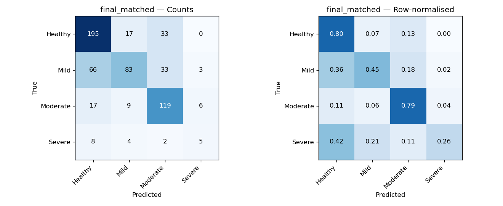
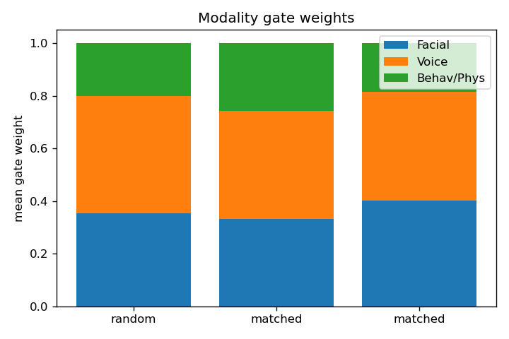

# Ablation results

| Model | Pairing | Acc | MacroF1 | WeightedF1 | ROC-AUC | QWK | Dep MAE | Anx MAE | Str MAE | mean R² |
|---|---|---|---|---|---|---|---|---|---|---|
| Tabular only (LightGBM) | n/a | 0.370 | 0.260 | 0.355 | 0.493 | 0.050 | 9.05 | 6.64 | 10.11 | -0.121 |
| Gated fusion | random | 0.553 | 0.474 | 0.551 | 0.775 | 0.437 | 7.88 | 6.23 | 9.28 | 0.071 |
| Gated fusion | matched | 0.655 | 0.571 | 0.643 | 0.849 | 0.564 | 7.59 | 6.02 | 9.06 | 0.090 |
| + ordinal + modality dropout (final) | matched | 0.670 | 0.575 | 0.658 | 0.864 | 0.562 | 7.71 | 6.09 | 8.95 | 0.060 |
| Audio only (aux head) | none | 0.625 | 0.557 | 0.626 | 0.809 | 0.517 | — | — | — | — |
| Image only (aux head) | none | 0.455 | 0.382 | 0.423 | 0.697 | 0.306 | — | — | — | — |
| Decision-level fusion, uniform | none | 0.652 | 0.572 | 0.641 | 0.834 | 0.543 | — | — | — | — |
| Decision-level fusion, tuned | none | 0.658 | 0.577 | 0.650 | 0.842 | 0.547 | — | — | — | — |

**Key finding — feature-matched alignment helps.** Matched pairing beats random pairing by ~10 accuracy points and ~0.13 QWK under an identical model, isolating the contribution of the alignment engine (criterion 3).

**Tabular is near-noise** (LightGBM acc 0.37, negative R²); fusion carries the signal via the voice and face emotion channels — confirmed by the gate weights (voice ≈ 0.41, face ≈ 0.34–0.40, tabular ≈ 0.18–0.26).

Severe-class recall stays low (~0.26–0.32): the CSV is heavily skewed (Severe ≈ 3%, only 19 test participants) — a stated limitation, not a bug.

## Did we need the pairing? (decision-level fusion, §4.9)

Decision-level fusion combines the three per-modality aux posteriors with **no pairing in training**. Uniform acc 0.652, tuned acc 0.658 (weights face 0.45 / voice 0.50 / tab 0.05 — the near-zero tab weight confirms the tabular channel is noise).

The joint gated model reaches a similar classification accuracy **and** additionally delivers Objective-2 regression and Objective-3 per-participant gate weights, which decision-level fusion structurally cannot. That is the justification for the alignment engine.

## Concordance (modality agreement) — accuracy by routing band

| Subset | mean conc | report acc | caveat acc | human-review acc |
|---|---|---|---|---|
| all | 0.705 | 0.691 (n=246) | 0.672 (n=338) | 0.312 (n=16) |
| clean | 0.695 | 0.638 (n=188) | 0.678 (n=292) | 0.231 (n=13) |
| conflict | 0.748 | 0.862 (n=58) | 0.630 (n=46) | 0.667 (n=3) |

**Accuracy drops in the low-concordance (human-review) band** — the concordance score is a genuine reliability signal, not decoration. Headline uses the `clean` (non-conflict) subset.

